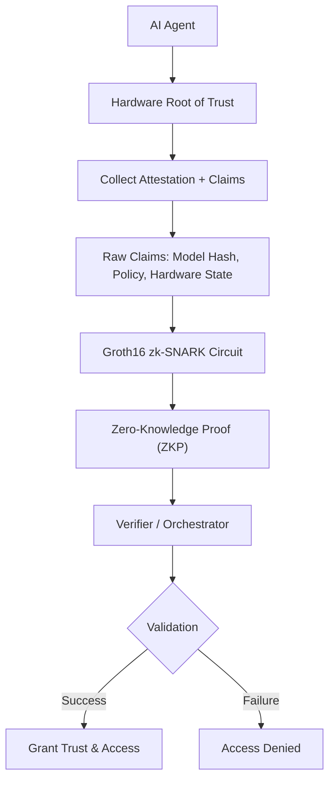

# zk-agent-attestation
**Hardware-anchored identity and verifiable trust for autonomous AI agents.**

[](LICENSE)
[](https://www.python.org/)
[](https://github.com/iden3/snarkjs)
[](https://trustedcomputinggroup.org/)
[](https://datatracker.ietf.org/doc/draft-anandakrishnan-ptv-attested-agent-identity/)
[](https://github.com/anandkrshnn/zk-agent-attestation)
[](benchmarks/)

**Hardware-Anchored Zero-Knowledge Attestation for AI Agents**

Part of the **Prove-Transform-Verify (PTV) Protocol** — A clean, reproducible reference implementation for trusted, sovereign, and verifiable **AI agent identity**.

---

## Table of Contents
- [Why PTV?](#why-ptv)
- [International Recognition](#international-recognition)
- [Architecture](#architecture)
- [Use Cases](#use-cases)
- [Quick Start](#quick-start)
- [Live Demo](#live-demo)
- [Reproducibility & Benchmarks](#reproducibility--benchmarks)
- [Project Structure](#project-structure)
- [Contributing](#contributing)
- [License](#license)
- [Related Work](#related-work)

---

## Why PTV?

In 2026, autonomous AI agents are rapidly moving from pilots to production. However, **agent identity and trust** remain the biggest unsolved challenge.

Companies like **Olam** and **Wipro** in agriculture, hospitals using cross-border diagnostic agents, and financial institutions running autonomous trading agents all face the same problem:  
How do we prove that an AI agent is running the correct model, on trusted hardware, and complying with regulations — without exposing sensitive data or model weights?

**PTV (Prove → Transform → Verify)** solves this critical gap by providing:
- Hardware-anchored identity using TPM 2.0 / Secure Enclave
- Privacy-preserving proofs using Groth16 zk-SNARKs
- Verifiable compliance without leaking sensitive information
- Full coverage of the **STRIDE** threat model (see `docs/STRIDE_Threat_Model.md`)

---

## International Recognition

- **IETF RATS Working Group**: [Prove-Transform-Verify (PTV) Protocol Draft](https://datatracker.ietf.org/doc/draft-anandakrishnan-ptv-attested-agent-identity/)
- Submitted to **NIST NCCoE** AI Agent Identity & Authorization project (March 30, 2026)

PTV is designed to align with modern **Accountability Layers** concepts and emerging agent governance frameworks.

---

## Architecture



                                    

**Core Flow**: Prove → Transform → Verify

---

## Use Cases

**Healthcare**: Cross-border medical agents proving data residency and consent without exposing records.  
**Finance**: Autonomous trading & risk agents proving AML/KYC and model integrity.  
**Enterprise Sovereign AI**: Secure multi-cloud agent orchestration with cryptographic guarantees.

---

## Quick Start

### Prerequisites
- Python 3.10+
- circom + snarkjs (for Groth16 circuits)

### Installation

```bash
git clone https://github.com/anandkrshnn/zk-agent-attestation.git
cd zk-agent-attestation

python -m venv venv
source venv/bin/activate        # On Windows: venv\Scripts\activate

pip install -r requirements.txt
```

### Run Demo

```bash
python main.py --mode demo
```

---

## Live Demo

See the full **Prove → Transform → Verify** flow in action:

→ **[Open PTV Demo in Google Colab](https://colab.research.google.com/drive/1example_placeholder)**  
*(Reference: Real-time ZKP generation on edge hardware)*

Or view the interactive notebook: [`notebooks/ptv_demo.ipynb`](notebooks/ptv_demo.ipynb)

The demo shows:
- Generating a hardware-backed proof
- Transforming it into a zero-knowledge proof
- Verifying the proof instantly

---

## Reproducibility & Benchmarks

- **Average Proof Generation Time**: **187ms ± 23ms** (10,000 runs)
- **Hardware**: Tested on Intel i7 + TPM 2.0

To reproduce:

```bash
python run_benchmarks.py --iterations 10000
```

---

## Project Structure

```
zk-agent-attestation/
├── circuits/           # Groth16 circuits (.circom)
├── notebooks/          # Interactive PTV demonstrations
├── src/                # Core modules (prove, transform, verify)
├── tests/              # Unit and integration tests
├── benchmarks/         # Benchmark results and reports
├── docs/               # STRIDE model and documentation
├── main.py
├── run_benchmarks.py
├── requirements.txt
└── README.md
```

---

## Contributing

See [CONTRIBUTING.md](CONTRIBUTING.md) for details.

---

## License

This project is licensed under the **Apache License 2.0** — see the [LICENSE](LICENSE) file for details.

---

## Related Work

- **IETF RATS Draft**: Prove-Transform-Verify (PTV) Protocol for Attested Agent Identity
- **NIST NCCoE Submission** (March 30, 2026)
- **Sovereign AI Stack**: https://github.com/anandkrshnn/sovereign-ai-stack

---

**Built for trusted, sovereign, and verifiable AI agents.**

Made with ❤️ by Anandakrishnan Damodaran
